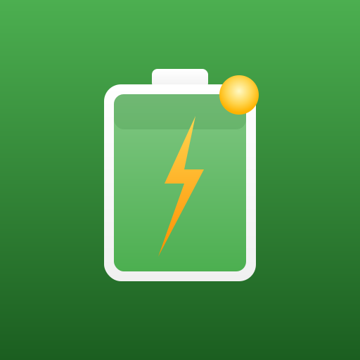

# Smart Energy Manager

A Home Assistant custom integration for smart energy management of solar+battery systems. Automated night charging during cheapest electricity hours and surplus load management that activates loads when solar production exceeds consumption.

**Inverter-agnostic** — supports Solax, GoodWe, SolarEdge, Huawei, Wattsonic GEN2, or any inverter with mode select entities in Home Assistant.

---

## Features

### Night Charging
- Dynamic charging window calculation (1-6 hours based on energy deficit)
- SOC trajectory simulation — hour-by-hour forward simulation for precise charge decisions
- Cheapest price window selection within configurable night hours
- Solar forecast integration with error correction (7-day sliding window)
- Consumption tracking with sliding window average (7-day, 3-period day model)
- Price threshold with emergency low-battery override (SOC < 25%)
- Charging state persists across HA restarts
- Modbus call timeout protection (30s) with stall detection

### Surplus Load Management
- Generic, priority-based controller for loads consuming solar surplus
- Two modes: **reactive** (surplus-triggered) and **predictive** (scheduled with forecast evaluation)
- True surplus calculation: `grid_export + sum(running_load.power_kw)`
- Per-load SOC thresholds, power margins, anti-flap protection
- Outdoor temperature gating — skip loads when it's warm enough outside
- Predictive evaluation checks impact on reactive loads (won't starve lower-priority loads)
- Surplus forecasting (today + tomorrow after sunset)
- Runtime tracking, energy metering, utilization efficiency

### General
- Multi-step config flow with inverter templates for easy setup
- All settings exposed as number entities (controllable from dashboard/automations)
- Configurable notifications for all events
- JSON-based persistence
- 285 unit tests, pure logic modules with zero HA dependencies

## Installation

### HACS (Recommended)

1. Add this repository to HACS as a custom repository
2. Search for "Smart Energy Manager" and install
3. Restart Home Assistant
4. Go to Settings > Devices & Services > Add Integration > Smart Energy Manager

### Manual

1. Copy `custom_components/smart_energy_manager/` to your HA `custom_components/` directory
2. Restart Home Assistant
3. Add the integration via Settings > Devices & Services

## Configuration

The integration uses a multi-step config flow:

1. **Name** — Instance name
2. **Inverter Template** — Pick your inverter (Solax, GoodWe, SolarEdge, Huawei, Wattsonic, or Custom)
3. **Inverter Entities** — SOC sensor, capacity sensor, mode/charge entities
4. **Inverter Values** — Mode option strings (pre-filled from template)
5. **Price Sensor** — Spot electricity price sensor with hourly attributes
6. **Solar Forecast** — Today/tomorrow forecast sensors (multiple orientations supported)
7. **Consumption** — Daily consumption sensor (resets at midnight)
8. **Analytics** — Optional grid import/export and solar production sensors
9. **Settings** — Battery capacity, SOC limits, charge power, price threshold, etc.

### Surplus Load Management

Configure via Settings > Devices > Smart Energy Manager > Configure > Surplus Load Management:

- **Add/Edit/Remove loads** through the UI (no YAML editing)
- **Reactive mode**: turns on when grid export exceeds margin, SOC above threshold
- **Predictive mode**: runs on daily schedule, pre-evaluated against solar forecast
- **Per-load settings**: power draw, priority, SOC thresholds, margins, switch interval, max outdoor temp

## Entities Created

### Sensors
| Entity | Description |
|--------|-------------|
| Average Daily Consumption | 7-day sliding window average |
| Today/Tomorrow Solar Forecast | Combined forecast (all orientations) |
| Solar Forecast Error Average | 7-day error tracking (%) |
| Today Solar Forecast Error | Live forecast vs actual |
| Tomorrow Energy Forecast | Adjusted solar minus consumption |
| Battery Charge kWh | Current charge in kWh |
| Battery Usable Charge | Charge above minimum SOC |
| Battery Capacity to Max | Remaining to configured max |
| Night Charging Status | Idle/Scheduled/Charging/Complete/Disabled |
| Last Night Charge kWh | SOC delta converted to kWh |
| Last Charge Battery/Time Range | Start→End SOC and time |
| Last Charge Total Cost | kWh × avg price |
| Electricity Price Status | Very Cheap/Cheap/Normal/Expensive |
| Today/Tomorrow Cheapest Hours | Top 3 cheapest hours |
| Self Consumption / Grid Dependency | Daily ratios |
| Morning SOC | Battery level at sunrise |
| Surplus Forecast | Today/tomorrow surplus kWh with hourly breakdown |
| Surplus Load Status | Active loads, power, runtime, utilization |
| BMS Battery Capacity | Tracked from inverter |

### Binary Sensors
| Entity | Description |
|--------|-------------|
| Charging Active | Currently force-charging |
| Charging Recommended | Price below threshold and SOC below max |

### Number Entities
| Entity | Description |
|--------|-------------|
| Max Charge Level | % |
| Min SOC | % |
| Max Charge Power | kW |
| Max Charge Price | Currency/kWh |
| Fallback Consumption | kWh (used when no history) |

### Switch
| Entity | Description |
|--------|-------------|
| Enabled | Master on/off |

## Architecture

```
coordinator.py            ← DataUpdateCoordinator (30s refresh)
├── planner.py            ← SOC trajectory simulation, charging decisions
├── charging_controller.py ← Inverter control state machine
├── surplus_controller.py  ← Multi-load surplus management
├── price_analyzer.py     ← Price extraction, cheapest window
├── forecast_corrector.py ← 7-day forecast error tracking
├── consumption_tracker.py ← 7-day consumption average
├── inverters/            ← Inverter abstraction (select, EMS)
├── notifier.py           ← HA notification service
├── storage.py            ← JSON persistence via HA Store
└── config_flow.py        ← Multi-step setup + surplus load menu
```

## Development

```bash
# Run tests (no HA installation needed)
cd smart-energy-manager
python3 -m pytest tests/ -v
```

## License

MIT
